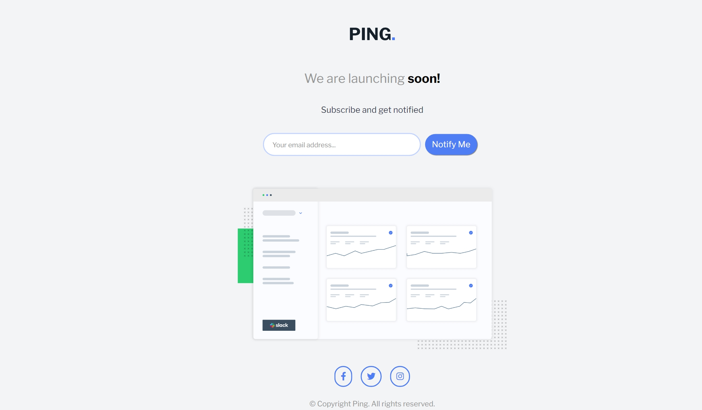

# Frontend Mentor - Ping coming soon page solution

This is a solution to the [Ping coming soon page challenge on Frontend Mentor](https://www.frontendmentor.io/challenges/ping-single-column-coming-soon-page-5cadd051fec04111f7b848da). Frontend Mentor challenges help you improve your coding skills by building realistic projects. 

## Table of contents

- [Overview](#overview)
  - [The challenge](#the-challenge)
  - [Screenshot](#screenshot)
- [My process](#my-process)
  - [Built with](#built-with)
  - [What I learned](#what-i-learned)
- [Author](#author)

**Note: Delete this note and update the table of contents based on what sections you keep.**

## Overview

### The challenge

Users should be able to:

- View the optimal layout for the site depending on their device's screen size
- See hover states for all interactive elements on the page
- Submit their email address using an `input` field
- Receive an error message when the `form` is submitted if:
	- The `input` field is empty. 
	- The email address is not formatted correctly (i.e. a correct email address should have this structure: `name@host.tld`). 

### Screenshot

## My process

### Built with

- Semantic HTML5 markup
- CSS custom properties
- Flexbox
- CSS Grid
- Mobile-first workflow
- tailwind

### What I learned

From this project,  i learnt and practiced:

Tailwind CSS: Applied utility-first classes for styling, including responsive design and custom configurations.
- HTML & CSS: Structured and styled a webpage with Tailwind and minimal custom CSS.
- JavaScript: Implemented form validation and dynamic content updates based on user input.
- Responsive Design: Used Tailwind to create a responsive
layout with Flexbox.
- Icons: Integrated and styled Font Awesome icons.
- GitHub: Used Git and GitHub for version control and project management.

Overall, you gained practical experience in creating a responsive, styled webpage with Tailwind CSS and interactive JavaScript features. 

